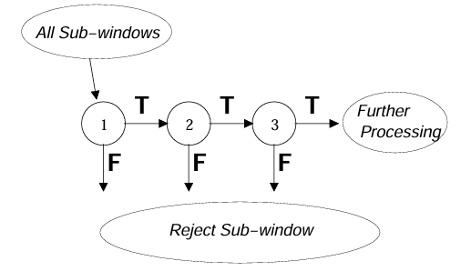
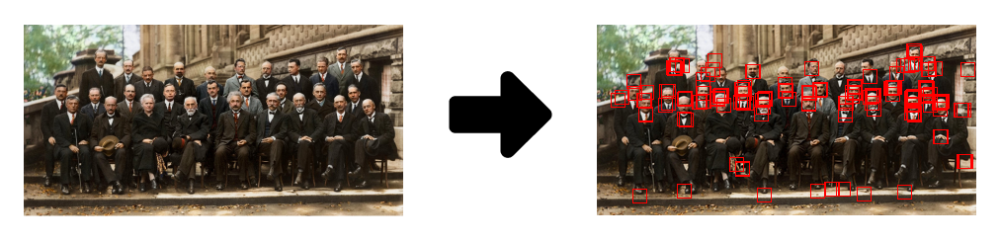
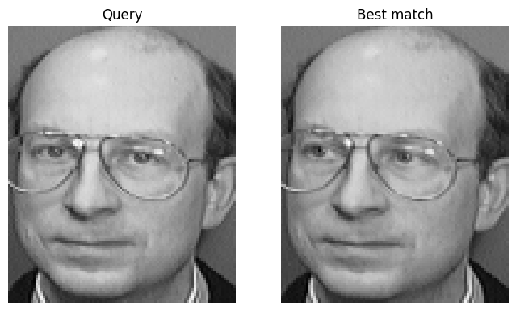

# exVision: FacialSys
## Overview
FacialSys is a facial system that incorporates both face detection and recognition using classical computer vision techniques. The system employs the **Viola-Jones** algorithm for face detection, which leverages **integral images**, **Haar-like features**, and **cascade AdaBoost classifiers** for real-time and robust face detection. For face recognition, the system uses Principal Component Analysis **(PCA)** to extract and analyze key features from facial images, enabling efficient recognition through the **Eigenfaces** method. The application is implemented using PyQt5 for the desktop interface, providing an intuitive environment for real-time usage.

## System Components

### Face Detection 
We employ the Viola-Jones object detection algorithm, which uses a cascade of classifiers boosted by the AdaBoost algorithm to efficiently detect faces in real-time. This method operates as a **three-stage** filtering process, where each stage applies progressively more complex classifiers to quickly discard regions that do not contain a face, while focusing computational resources on promising candidates.

  

The algorithm scans the image using sliding windows of **15x15**, applying Haar-like features to each window to capture essential facial patterns, such as edges, lines, and textures. By leveraging integral images for fast computation, Viola-Jones can detect faces swiftly and accurately, even in varying lighting conditions or complex backgrounds. 

  

### Detection Dataset
- For positive class ("face"), we used the Yearbook Dataset from [A Century of Portraits:
A Visual Historical Record of American High School Yearbooks](https://people.eecs.berkeley.edu/~shiry/projects/yearbooks/yearbooks.html).
    > It contains **37,921** pictures of frontal-facing portraits of size **$186 \times 171$** where we will assume the face to be in the center.

- For the negative class ("not a face") we made use of the [Stanford Backgrounds Dataset](http://dags.stanford.edu/projects/scenedataset.html) for scene understanding.
    > It contains **715** images of various scenes, from which we will randomly crop regions to be used as background classes. The images are approximately of size **$320 \times 240$** and do contain faces in camera-facing poses.
___

**For a more in-depth understanding of the methodology and analysis, please refer to [Viola-Jones.ipynb](Attachments\Viola-Jones.ipynb) notebook in the attachment folder.** 

### Face recognition
For face recognition, we employ Principal Component Analysis (PCA), often referred to as the Eigenfaces method. PCA reduces the high dimensionality of facial images by projecting them into a lower-dimensional space while retaining the most important features.

The face recognition process follows these key steps:

1. **Dataset Preparation**: Facial images are resized and flattened into vectors, converting the 2D images into 1D arrays.
2. **Covariance Matrix Calculation**: The covariance matrix is computed to identify the directions of maximum variance in the data.
3. **Eigenface Extraction**: Eigenfaces, which are the principal components (eigenvectors) of the dataset, are extracted and represent the key facial features.
4. **Recognition**: New faces (Queries) are projected into the PCA space and compared with known faces for recognition based on their similarity.

  

### Recognition Dataset
- The dataset we used was the [ORL Database of Faces](https://cam-orl.co.uk/facedatabase.html), which is quite of age.
  > There are ten different images of each of **40** distinct subjects. For some subjects, the images were taken at different times, varying the lighting, facial expressions and facial details. The size of each image is $92 \times 112$ pixels.

___

**For a more in-depth understanding of the methodology and analysis, please refer to [PCA_analysis.ipynb](Attachments\PCA_analysis.ipynb) & [Face_recognition.ipynb](Attachments\Face_recognition.ipynb) notebooks in the attachment folder.** 

## Acknowledgments

- This project was supervised by [Dr. Ahmed Badawi](https://www.linkedin.com/in/ahmed-badawi-215167a/), who provided invaluable guidance and expertise throughout such incredible journey as part of computer vision course at Cairo University Faculty of Engineering.

- This [blog post](https://machinelearningmastery.com/face-recognition-using-principal-component-analysis/) was inspiring in face detection using PCA.

## References

If you're interested in learning more about the algorithms used in this project, you can refer to the following papers:

- Viola, P., & Jones, M. (2001). **Rapid Object Detection using a Boosted Cascade of Simple Features**. [Link to paper](https://www.cs.cmu.edu/~efros/courses/LBMV07/Papers/viola-cvpr-01.pdf).

- Kanan, C., & Cottrell, G. W. (2009). **Color-to-Grayscale: Does the Method Matter in Image Recognition?** Department of Computer Science and Engineering, University of California San Diego, La Jolla, California, United States of America. [Link to paper](https://doi.org/10.1371/journal.pone.0029740).

